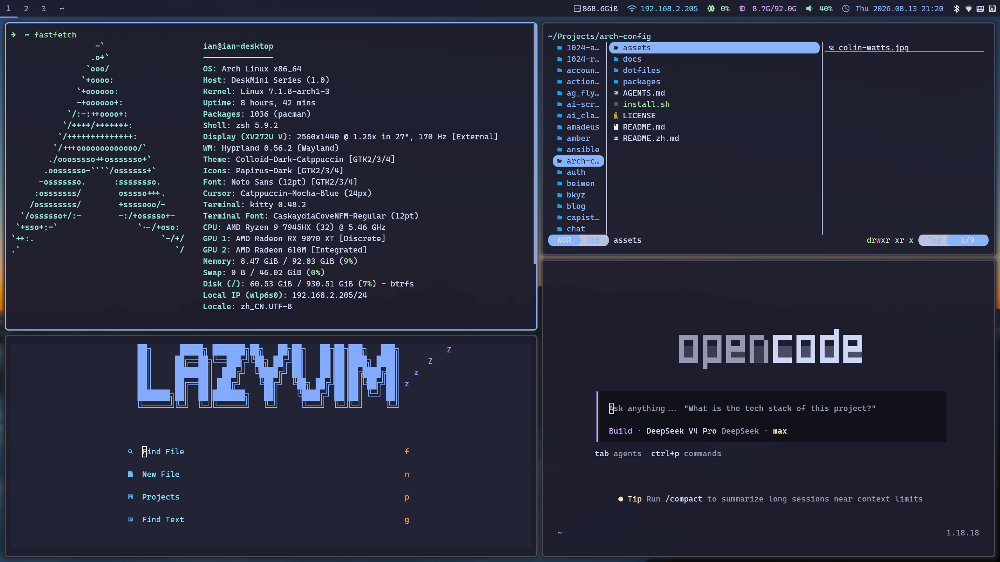

[English](README.md) | [中文](README.zh.md)



# arch-config — 自用 Arch Linux (Hyprland) 系统配置

自用 Arch Linux + Hyprland 引导配置，由 Ansible 管理。一个 playbook 装好
所有软件包并部署全部配置文件；主题为 catppuccin-mocha（蓝色强调）。

## 环境要求

- Arch Linux（已完成基础安装，例如用 archinstall——见下文「基础安装」）
- 已安装 `ansible` 包（`sudo pacman -S ansible`）
- sudo 权限（playbook 会询问 become 密码）

## 使用

```bash
git clone <你的仓库> ~/arch-config
cd ~/arch-config/playbooks
ansible-playbook site.yml --ask-become-pass               # 完整安装
ansible-playbook site.yml --tags waybar --ask-become-pass  # 只装某个应用
ansible-playbook site.yml --list-tasks                     # 查看可用任务
```

重复运行安全（幂等）。每个应用有自己的 tag，与应用同名（如 `waybar`、
`hyprland`、`zsh`、`nvim`）。

## 目录结构

```
playbooks/
├── site.yml                    # 入口：角色顺序 base → software → settings → services
├── inventory/
│   ├── hosts.ini               # 主机别名 "desktop"（connection=local）
│   ├── group_vars/all.yml      # 共享变量（home、uid、时区、主题、unit 列表）
│   └── host_vars/desktop.yml   # 机器变量：monitor、scale、net_interface
└── roles/
    ├── base/                   # 时区、locale、zram、sshd、用户组、默认 shell、xdg user-dirs
    ├── software/               # 软件包（_pacman.yml / _aur.yml）+ 每个应用一个 <app>.yml
    │   ├── files/<app>/        # 静态配置文件，每个应用一个目录（共 29 个应用）
    │   └── templates/<app>/    # hyprland.lua、waybar 配置、wechat 桌面项
    ├── settings/               # GTK/Qt/Kvantum/字体配置、fcitx5 与 SDDM 主题、gsettings
    └── services/               # 系统 systemd 单元 + 用户 pipewire/dsh-web 单元
```

`software` 角色管理 29 个应用（atuin、deepseek、dev、direnv、dsh-web、
dunst、fcitx5、git、github、gmail、hypridle、hyprland、hyprlock、hyprpaper、
kimi、kitty、mimeapps、mpv、nvim、pcmanfm、pi、rofi、satty、try-cli、waybar、
wechat、zathura、zed、zsh）。所有官方仓库包在 `tasks/_pacman.yml`，所有
AUR 包在 `tasks/_aur.yml`；各应用的任务文件只负责部署配置。

## 机器差异

与具体机器相关的值（显示器名称、缩放比例、网卡接口）放在
`playbooks/inventory/host_vars/desktop.yml`——在那里改，不要改模板。当前
值：显示器 `DP-1`、缩放 1.25、网卡 `wlp6s0`。要添加新机器，在
`inventory/hosts.ini` 里加主机别名，并配套一个 `host_vars/<名称>.yml`。

## 桌面组件

- hyprland + waybar（窗口管理 / 状态栏）
- hyprlock + hypridle（锁屏 / 息屏）
- hyprpaper（壁纸）
- rofi（应用 / 表情启动器）
- grim + slurp + satty（截图标注）
- hyprpicker（取色器）
- wl-clipboard + cliphist（剪贴板）
- dunst（通知）
- nwg-look（GTK 外观设置）
- hyprpolkitagent（polkit 代理）
- sddm（登录管理器，catppuccin 主题）

## 基础安装（archinstall 建议）

- 文件系统如用 btrfs，装完补 `compsize`
- 镜像源：`reflector --country China --protocol https --latest 10 --sort rate --save /etc/pacman.d/mirrorlist`
- playbook 会把时区设为 Asia/Shanghai，并生成 en_US.UTF-8 + zh_CN.UTF-8，默认 `LANG=zh_CN.UTF-8`（终端报错保持英文 `LC_MESSAGES=en_US.UTF-8`）

## 装完后的手工事项

1. **显示器**：`hyprctl monitors` 查看接口名，编辑 `playbooks/inventory/host_vars/desktop.yml` 里的 `monitor`/`scale`，然后重跑 `ansible-playbook site.yml --tags hyprland`（生成的 `~/.config/hypr/hyprland.lua` 现在是模板渲染产物，直接手改会被覆盖）。默认 `DP-1` + 缩放 1.25，外接显示器通常用 1
2. **neovim**：配置由 playbook 部署（LazyVim），首次启动自动装插件并编译 tree-sitter grammar（需 gcc，已在包清单里）
3. **输入法**：重新登录后 fcitx5 自启，rime 首次会自动部署雾凇拼音（rime-ice）。想保留旧词频，复制旧系统 `~/.local/share/fcitx5/rime/*.userdb`
4. **dropbox**：`hl.exec_cmd("dropbox")` 在 hyprland.lua 里被注释掉了，装好 AUR 包后按需取消注释
5. **VirtualBox**：扩展包在 AUR `virtualbox-ext-oracle`；内核更新后如模块失效，执行 `sudo vboxreload`
6. **goldendict-ng**：词典需手动放置，见 [Dictionaries](https://github.com/xiaoyifang/goldendict-ng?tab=readme-ov-file#dictionaries) 文档（词典文件可放 `~/.local/share/goldendict`，然后在设置里添加目录）。登录自启常驻托盘，`Super+T` 通过单实例 IPC 转发查询词，免冷启动
7. **git**：git 应用首次运行时（仅当 `~/.config/git/config` 不存在）playbook 会交互询问 `user.name`/`user.email`，保存在 `~/.config/git/config`——该文件归你所有，之后不会被覆盖。共享配置（delta、catppuccin 主题）在 `~/.config/git/custom`，由 playbook 管理，请勿手动修改

## dsh web（DeepSeek Harness）

`dsh web` 在 <http://127.0.0.1:3080> 提供 DeepSeek Harness 编码代理的浏览器界面。playbook 会全局安装 CLI（`npm i -g @deepseek-ai/dsh`，落在 `~/.local/bin/dsh`）；`dsh-web` 应用部署用户 unit（`~/.config/systemd/user/dsh-web.service`），`services` 角色负责启用，登录即自启：

```bash
systemctl --user status dsh-web        # 状态
journalctl --user -u dsh-web -f        # 跟踪日志
systemctl --user restart dsh-web       # 重启
```

- **端口**：默认绑定 127.0.0.1:3080（`--host 0.0.0.0` 被设计上拒绝）。改端口：编辑 `~/.config/systemd/user/dsh-web.service` 的 `ExecStart=... dsh web --port 8080`，然后 `systemctl --user daemon-reload && systemctl --user restart dsh-web`
- **API 密钥**：放 `~/.dsh/.env`（如 `DEEPSEEK_API_KEY=...`）——launcher 会自动加载；不要把密钥写进 unit 文件
- **升级**：`npm i -g @deepseek-ai/dsh@latest && systemctl --user restart dsh-web`
- **npm ≥ 12** 默认拦截安装脚本，`npm i -g` 会警告 koffi/node-pty 等——dsh 仍可正常工作（原生预编译随包自带，或按需现场编译）。想执行这些脚本：`npm i -g --allow-scripts=@deepseek-ai/dsh-subprocess-local,koffi,node-pty,@google/genai,protobufjs @deepseek-ai/dsh`
- **端口被占用**：若还有旧的 `npx @deepseek-ai/dsh web` 实例在跑，先停掉（`pkill -f "dsh web"`），再 `systemctl --user reset-failed dsh-web && systemctl --user restart dsh-web`
- **只铺配置**：若只跑 `--tags dsh-web`，unit 文件会部署但不会启用——手动执行一次 `systemctl --user enable --now dsh-web`

## 键位

| 快捷键 | 功能 |
| --- | --- |
| `Super+Return` | 终端 |
| `Super+D` | 应用启动器 |
| `Super+E` | 表情选择 |
| `Super+Ctrl+C` | 浏览器（Chrome） |
| `Super+Ctrl+F` | Firefox |
| `Super+Ctrl+R` | RubyMine |
| `Super+Ctrl+P` | PyCharm |
| `Super+F3` | 文件管理器（pcmanfm） |
| `Super+T` | 选中文字查词典（goldendict） |
| `Super+O` | 剪贴板历史（cliphist + rofi） |
| `Super+C` | 取色器（hyprpicker，自动复制） |
| `Super+P` | 区域截图（satty 标注） |
| `Print` | 全屏截图 |
| `Shift+Print` | 区域截图（无标注） |
| `Super+Q` | DeepSeek scratchpad |
| ``Super+` `` | Kimi scratchpad |
| `Super+Shift+Q` | 关闭窗口 |
| `Super+F` | 全屏 |
| `Super+Shift+Space` | 浮动 |
| `Super+W` | 标签组 |
| `Super+V` | 预置方向分屏（下） |
| `Super+;` | 预置方向分屏（右） |
| `Super+H/J/K/L` | 焦点（含方向键） |
| `Super+Shift+H/J/K/L` | 移动窗口（含方向键） |
| `Alt+Tab` | 前一工作区 |
| `Super+Ctrl+←/→` | 相邻工作区 |
| `Super+1..9` | 工作区 |
| `Super+Shift+1..9` | 移到工作区 |
| `Super+滚轮` | 切换工作区 |
| `Super+鼠标左键` | 拖动窗口 |
| `Super+鼠标右键` | 缩放窗口 |
| `Super+R` | resize 模式（H/J/K/L 调整，Enter/Esc 退出） |
| `Super+Ctrl+L` | 锁屏 |
| `Super+0` | 电源菜单 |
| `Super+Shift+E` | 退出 Hyprland |
| `Super+M` | 隐藏/显示状态栏 |
| `Super+Shift+D` | 重启 dunst |
| `Super+Shift+C` | 重载配置 |
| `XF86AudioRaiseVolume` | 音量 + |
| `XF86AudioLowerVolume` | 音量 − |
| `XF86AudioMute` | 静音 |
| `XF86MonBrightnessUp` | 亮度 + |
| `XF86MonBrightnessDown` | 亮度 − |
| `XF86AudioPlay` | 播放/暂停 |
| `XF86AudioNext` | 下一首 |
| `XF86AudioPrev` | 上一首 |

## 可能装不上的包（playbook 会警告跳过）

AUR 包名会变动。若 `zed` 官方仓库版本不合意可用 AUR `zed-preview-bin`；`pycharm`/`rubymine` 是 AUR 构建（下载官方 tarball），也可用 JetBrains Toolbox 手动装。

## 许可证

MIT，详见 [LICENSE](LICENSE)。
